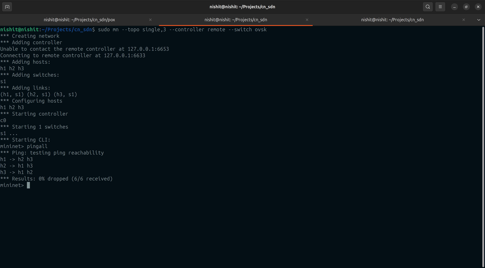
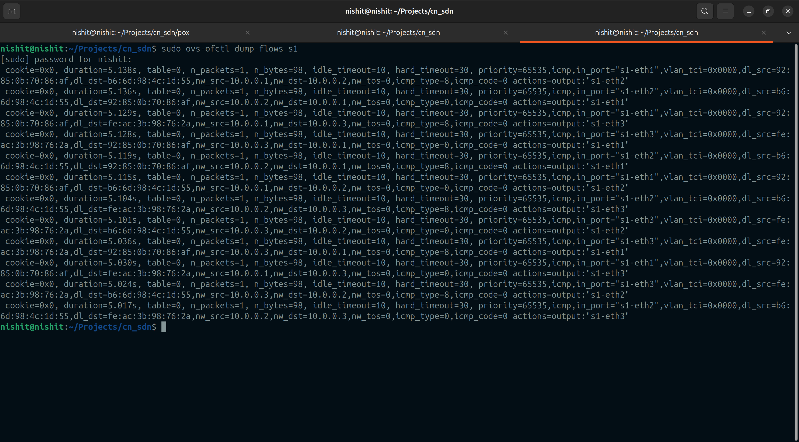
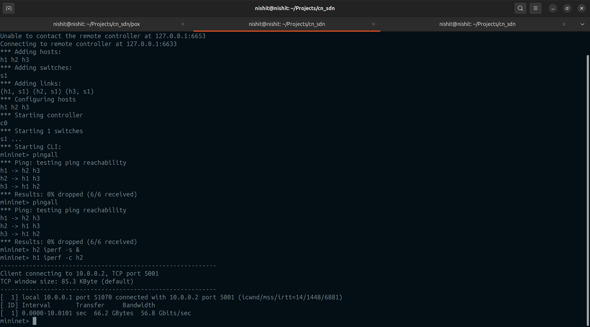
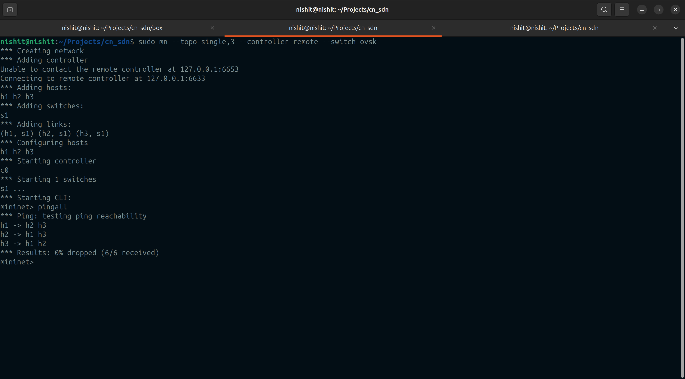
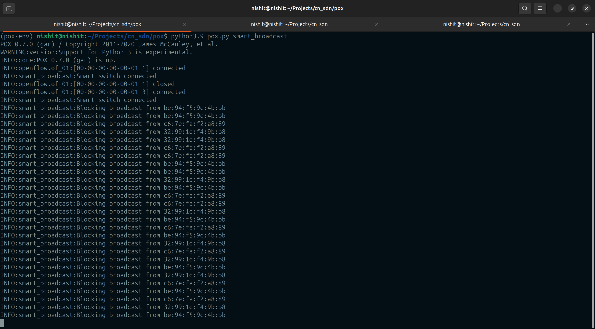
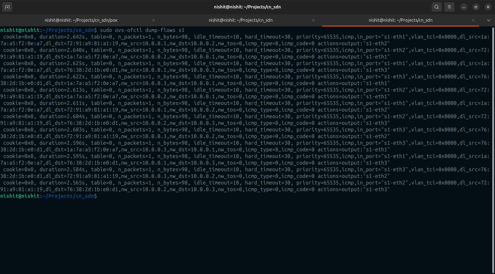
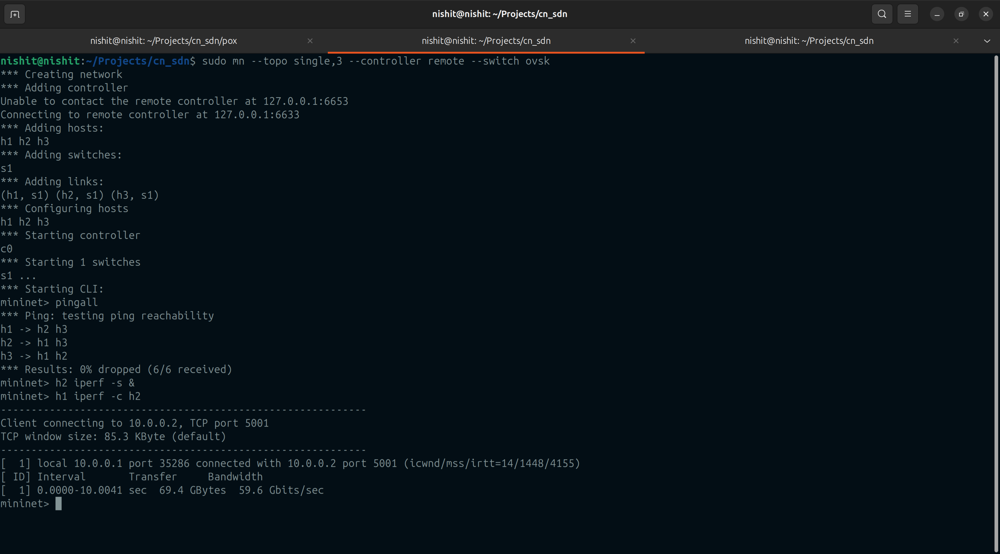
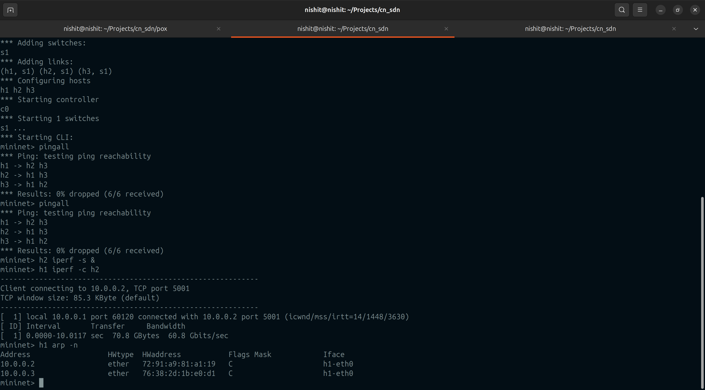

# SDN Broadcast Traffic Control using Mininet & POX

### Name: Nishit DB
### SRN: PES1UG24CS303

------------------------------------------------------------

## Problem Statement
In traditional networks, broadcast traffic (such as ARP requests) is flooded to all devices, which can lead to unnecessary congestion and reduced efficiency.  

This project implements a Software Defined Networking (SDN) approach to **control excessive broadcast traffic** using a centralized controller.

------------------------------------------------------------

## Objectives
- Detect broadcast packets in the network
- Limit unnecessary broadcast flooding
- Implement selective forwarding rules using SDN
- Analyze network behavior using Mininet tools

------------------------------------------------------------

## Tools Used
- **Mininet** – for network simulation  
- **POX Controller** – for implementing SDN logic  
- **Open vSwitch** – for programmable switching  
- **iperf** – for measuring network throughput  

------------------------------------------------------------

## Approach

We extended the POX **learning switch** with custom logic:

- **ARP Broadcast Allowed**  
  ARP is essential for resolving IP → MAC addresses, so it must not be blocked.

- **Non-ARP Broadcast Blocked**  
  Other broadcast packets are unnecessary and cause flooding, so they are dropped.

- **Normal Unicast Traffic Allowed**  
  Ensures regular communication between hosts works without disruption.

👉 This achieves a balance between **network functionality and efficiency**.

------------------------------------------------------------

## Setup & Execution

### 1. Clone POX
git clone https://github.com/noxrepo/pox.git  
cd pox  

---

### 2. Run Controller

**Baseline (Normal Behavior):**
python3.9 pox.py forwarding.l2_learning  

**Broadcast Control:**
python3.9 pox.py smart_broadcast  

---

### 3. Run Mininet
sudo mn -c  
sudo mn --topo single,3 --controller remote --switch ovsk  

------------------------------------------------------------

## Scenario 1: Baseline (Normal Switch)

### Ping Test
pingall  

📸 Screenshot:  

**Explanation:**  
All hosts successfully communicate. Broadcast traffic is fully allowed, leading to normal but inefficient flooding.

---

### Flow Table
sudo ovs-ofctl dump-flows s1  

📸 Screenshot:  

**Explanation:**  
Flow rules are dynamically installed by the controller to handle packet forwarding.

---

### Throughput Test
h2 iperf -s &  
h1 iperf -c h2  

📸 Screenshot:  

**Explanation:**  
Network throughput is measured under normal conditions.

------------------------------------------------------------

## Scenario 2: Broadcast Controlled Network

### Ping Test
pingall  

📸 Screenshot:  

**Explanation:**  
Ping still works, proving that essential communication (ARP + ICMP) is not affected.

---

### Controller Logs

📸 Screenshot:  

**Explanation:**  
Logs show that non-ARP broadcast packets are detected and blocked by the controller.

---

### Flow Table
sudo ovs-ofctl dump-flows s1  

📸 Screenshot:  

**Explanation:**  
Flow rules reflect selective forwarding decisions made by the controller.

---

### Throughput Test
h2 iperf -s &  
h1 iperf -c h2  

📸 Screenshot:  

**Explanation:**  
Throughput remains stable, showing that broadcast control does not degrade performance.

---

### ARP Table Check
h1 arp -n  

📸 Screenshot:  

**Explanation:**  
ARP resolution works correctly, confirming that essential broadcast traffic is allowed.

------------------------------------------------------------

## Observations

**Baseline Network:**
- Broadcast traffic is fully flooded  
- Higher unnecessary traffic  
- Normal connectivity  

**Controlled Network:**
- Unnecessary broadcast reduced  
- Efficient traffic handling  
- Connectivity preserved  

------------------------------------------------------------

## Results

- Successfully detected broadcast packets  
- Reduced broadcast flooding  
- Maintained network functionality  
- Demonstrated SDN-based traffic control  

------------------------------------------------------------

## Conclusion

This project demonstrates how SDN enables centralized control over network behavior.  
By selectively filtering broadcast traffic, we improved network efficiency while maintaining essential communication.

------------------------------------------------------------

## References
- Mininet Documentation  
- POX Controller Documentation  
- OpenFlow Specification  

------------------------------------------------------------
